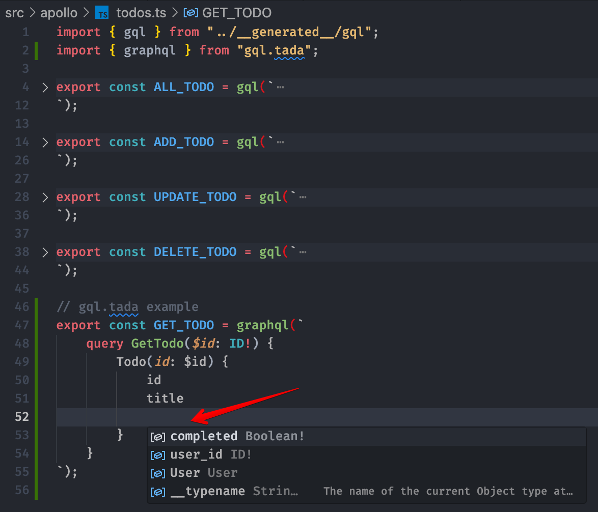
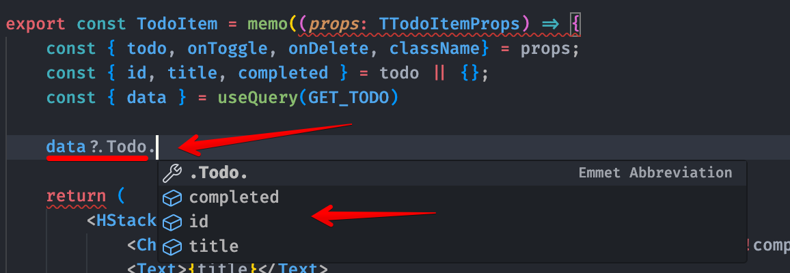

# GraphQL Todos

`yarn start:dev` - start dev (front + back)

`yarn compile` - generate graphql types (needed server is on)

- React
- TypeScript
- Vite (SWC)
- GraphQl
- JsonGraphQlServer
- GraphQlCodegen [link1](https://www.apollographql.com/docs/react/development-testing/static-typing/), [link2](https://the-guild.dev/graphql/codegen/docs/config-reference/schema-field#root-level)
- Chakra UI [link](https://chakra-ui.com/getting-started)

Based on [video](https://youtu.be/vlDhgLk5m84), but added:
- TS, 
- GraphQl Generator

### Bellow auto types graphql generator types is very faster and amazing!!! 🤩🤩🤩
An auto-generator of graphql query TS-types and VSCode autocomplete plugin has also been added. Using `gql.tada` ([link1](https://gql-tada.0no.co/), [link2](https://github.com/0no-co/gql.tada?tab=readme-ov-file), [link3](https://www.youtube.com/watch?v=PzhxN1u6ziQ)). 

Screenshots:


<br />


---

This template provides a minimal setup to get React working in Vite with HMR and some ESLint rules.

Currently, two official plugins are available:

- [@vitejs/plugin-react](https://github.com/vitejs/vite-plugin-react/blob/main/packages/plugin-react/README.md) uses [Babel](https://babeljs.io/) for Fast Refresh
- [@vitejs/plugin-react-swc](https://github.com/vitejs/vite-plugin-react-swc) uses [SWC](https://swc.rs/) for Fast Refresh

## Expanding the ESLint configuration

If you are developing a production application, we recommend updating the configuration to enable type aware lint rules:

- Configure the top-level `parserOptions` property like this:

```js
export default {
  // other rules...
  parserOptions: {
    ecmaVersion: 'latest',
    sourceType: 'module',
    project: ['./tsconfig.json', './tsconfig.node.json'],
    tsconfigRootDir: __dirname,
  },
}
```

- Replace `plugin:@typescript-eslint/recommended` to `plugin:@typescript-eslint/recommended-type-checked` or `plugin:@typescript-eslint/strict-type-checked`
- Optionally add `plugin:@typescript-eslint/stylistic-type-checked`
- Install [eslint-plugin-react](https://github.com/jsx-eslint/eslint-plugin-react) and add `plugin:react/recommended` & `plugin:react/jsx-runtime` to the `extends` list
